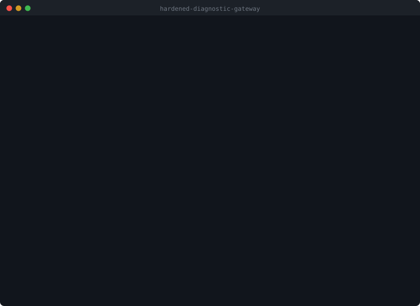

# Hardened Diagnostic Gateway

An automotive diagnostic stack written from scratch in C — ISO-TP transport, a
UDS server, a virtual ECU, a diagnostic tester and a fault injector — built to
stay correct and bounded when the bus traffic is malformed, truncated, out of
sequence or hostile.

No ISO-TP or UDS library is used. Implementing those layers is the project.

```
14 733 unit checks · 2 000 000 fuzz cases · 12 994 183 ISO-TP frames
Cross-validated against the Linux kernel ISO-TP stack
0 failures · 0 sanitizer findings · 0 heap allocations
```

Every figure above was measured, with the commands that produced it, in
[docs/results.md](docs/results.md).



*The full run: tests, architecture invariants, a diagnostic session against the
virtual ECU, fault injection, cross-validation against the kernel, and a fuzzing
campaign. Reproduce it with `tools/demo/demo.sh`; replay the recording with
`asciinema play docs/media/demo.cast`.*

---

## The problem

Sending a CAN frame is easy. The interesting question is different:

> does the stack stay correct, bounded and predictable when the traffic stops
> being well-behaved?

Modern vehicles are moving toward software-defined architectures — domain and
zonal controllers, gateways, remote diagnostics, OTA updates — where a
diagnostic endpoint is exposed to traffic it does not control. This project
treats every incoming byte as untrusted and gives correct *rejection* the same
weight as correct service.

A concrete example of what that means in practice. This frame announces seven
payload bytes but carries two:

```bash
cansend vcan0 7E0#071003
```

A parser that trusts the announced length reads five bytes that were never
received. This one refuses the frame, says why, and keeps serving.

## Architecture

```
        Diagnostic Tester                 Virtual ECU
              │                                ▲
              │ UDS                            │ UDS
              ▼                                │
        ┌───────────┐                    ┌───────────┐
        │  src/uds  │                    │  src/uds  │   sessions, security,
        └─────┬─────┘                    └─────▲─────┘   services, DTCs
              │                                │
        ┌─────▼─────┐                    ┌─────┴─────┐   SF · FF · CF · FC
        │ src/isotp │                    │ src/isotp │   reassembly, N_Bs, N_Cr
        └─────┬─────┘                    └─────▲─────┘
              │                                │
        ┌─────▼──────────────────────────────┴─────┐
        │            src/platform                  │   raw CAN socket,
        │      can_socket  ·  diag_link            │   session loop, clock
        └─────────────────────┬────────────────────┘
                              │
                            vcan0
```

`src/isotp/` and `src/uds/` include **no system header** — not even `<string.h>`.
They work on raw byte buffers and are handed the current time as a parameter.
Verified mechanically: they compile `-ffreestanding -nostdinc` and link with no
external symbol beyond their own functions. Porting to a microcontroller means
rewriting `src/platform/`, and nothing else.

```
├── src/
│   ├── isotp/          ISO-TP transport, no OS dependency
│   ├── uds/            UDS server, no OS dependency
│   ├── ecu/            virtual ECU: sensors, identifiers, fault memory
│   ├── tester/         diagnostic client
│   └── platform/       the only Linux-dependent code
├── tests/              4 suites, ASan + UBSan
├── fuzz/               in-process parser fuzzer
├── tools/fuzzer/       on-bus fault injector
└── docs/
```

## What it does

### ISO-TP — [full documentation](docs/isotp.md)

Single Frame, First Frame, Consecutive Frame, Flow Control, reassembly,
sequence-number checking, `N_Bs` and `N_Cr` timers, explicit state machines for
both directions.

Rejects, rather than trusts: `SF_DL` of 0 or above 7, a First Frame announcing
fewer than 8 bytes, an announced length exceeding the received DLC, a message
larger than the reassembly buffer (answered with `FlowStatus = Overflow`, not
silently dropped), consecutive frames with no transfer open, sequence numbers
that skip, and frame types 4–15 that do not exist.

### UDS — [full documentation](docs/uds.md)

| SID | Service | Extended session? | Unlock? |
|---|---|:---:|:---:|
| `0x10` | DiagnosticSessionControl | no | no |
| `0x11` | ECUReset | yes | yes |
| `0x14` | ClearDiagnosticInformation | yes | no |
| `0x19` | ReadDTCInformation | no | no |
| `0x22` | ReadDataByIdentifier | no | no |
| `0x27` | SecurityAccess | yes | no |
| `0x3E` | TesterPresent | no | no |

That table is not a description of the code — it *is* the code. The access
rules live in one table that runs before any handler, so a service added
without a rule is refused by default.

Plus proper `7F <SID> <NRC>` negative responses, the
`suppressPosRspMsgIndicationBit` (which silences positive replies only — an
error must always reach the client), and `S3server` session expiry that
re-locks security on its own.

### SecurityAccess — [full documentation](docs/security.md)

Seed/key exchange with a fresh seed per request, the seed consumed by the first
wrong key, replay refused, and a lockout after three failures that also refuses
new seed requests.

> The key derivation is a **demonstration and protects nothing** — the
> algorithm is public in this repository. What is implemented is the state
> handling around it, which is the part that carries over to a real design.
> [docs/security.md](docs/security.md) says exactly what to replace and why.

## Try it

```bash
sudo tools/setup/install.sh    # une seule fois : vcan0 devient permanente
make
```

`install.sh` pose une unité systemd, donc l'interface CAN virtuelle est
recréée à chaque démarrage de WSL. Rien à refaire ensuite. Pour l'annuler :
`sudo tools/setup/install.sh --uninstall`.

### Console web

```bash
make web        # http://127.0.0.1:8800
```

Quatre terminaux dans le navigateur — ECU, client de diagnostic, trafic CAN,
campagnes de test — un champ de saisie pour piloter l'ECU à la main, et un
bouton qui déroule tout le scénario en le commentant. Le serveur n'utilise que
la bibliothèque standard de Python, n'écoute que sur `127.0.0.1`, et n'accepte
que des commandes prédéfinies : le navigateur envoie un identifiant, jamais une
ligne de commande.

C'est un outil de démonstration dans `tools/`, sans lien de compilation avec
`src/`. La pile de diagnostic reste du C sans dépendance.

### En ligne de commande

Terminal 1: `./build/ecu` — Terminal 2: `./build/tester` — Terminal 3:
`candump vcan0`

Or drive it by hand:

```
$ ./build/diagcli

[DEFAULT | LOCKED] > session extended
  TX  10 03
  RX  50 03 00 32 01 F4
      OK     session EXTENDED

[EXTENDED | LOCKED] > read vin
  TX  22 F1 90
  RX  62 F1 90 56 46 31 48 44 47 32 41 58 34 37 31 32 39 33 30 35
      OK     DID F190  VIN
             ... = "VF1HDG2AX47129305"

[EXTENDED | LOCKED] > reset
  RX  7F 11 33
      REFUS  ECUReset -> NRC 0x33  securityAccessDenied
```

The prompt tracks the session and the security level, so the two preconditions
guarding a sensitive command are visible at all times. `help` lists the
commands; `raw 22 F1 90` sends arbitrary bytes.

The scripted `./build/tester` runs a 19-step scenario. Three moments worth
watching.

**A VIN is 17 bytes and a CAN frame holds 8**, so the transport earns its keep:

```
7E0  03 22 F1 90 ...          request
7E8  10 14 62 F1 90 56 46 31  First Frame, 0x014 = 20 bytes announced
7E0  30 00 00 ...             Flow Control, ContinueToSend
7E8  21 48 44 47 32 41 58 34  Consecutive Frame, sequence 1
7E8  22 37 31 32 39 33 30 35  Consecutive Frame, sequence 2
```

**A protected command is refused twice, for two different reasons.** From the
default session the session check stops it; once the session is open the
security check takes over. The changing NRC is the point:

```
[2]  ECUReset, default session   -> REFUS  NRC 0x7F  serviceNotSupportedInActiveSession
[8]  ECUReset, extended, locked  -> REFUS  NRC 0x33  securityAccessDenied
```

**A captured key is worthless.** After a successful unlock, replaying the very
same key immediately fails — the seed that justified it is gone:

```
[12] SecurityAccess, correct key -> OK     ACCES DEVERROUILLE
[13] SecurityAccess, replayed    -> REFUS  NRC 0x22  conditionsNotCorrect
```

Full walk-through: [docs/demo.md](docs/demo.md).

## Break it

```bash
./build/ecu -q &
./build/fuzz_bus 200 0xBADC0DE
```

Eleven targeted scenarios rather than random noise — a purely random first byte
is rejected outright 15 times out of 16, so each scenario builds a plausible
sequence and corrupts it at one point: wrong sequence numbers, missing
consecutive frames, 4 GB length announcements, orphan frames, interleaved
transfers, keys with no seed, resets with no unlock.

```
     200 attaques ... ECU toujours operationnel
  sondes de vitalite     : 10
  sondes reussies        : 10
  ECUReset non autorises : 0
```

The line that matters is `sondes reussies`. Every 25 attacks the fuzzer sends a
perfectly valid request and requires the exact expected reply — because
rejecting an attack proves nothing if the context stays broken afterwards.

At scale, in memory, under sanitizers:

```bash
./build/fuzz_parser 2000000 0x5EED1
```

```
  trames ISO-TP          : 12994183
  erreurs de sequence    : 988290
  debordements refuses   : 268
  delais expires         : 181926
  ANOMALIES              : 0
```

## Verify it

```bash
make test               # 14 733 checks, ASan + UBSan
make fuzz               # parser fuzzing campaign
make check-portability  # architecture invariants
```

`check-portability` fails the build if a system header reaches the protocol
layers, if anything under `src/` calls the allocator, if the protocol layers
stop compiling freestanding or under `-Wconversion -Wshadow -Werror`, or if
`nm` finds an allocator symbol in a linked binary. An invariant nobody verifies
is a comment, not a constraint.

Two suites are exhaustive rather than sampled: the ISO-TP decoder is swept over
all 256 PCI values × 9 frame lengths, and the UDS server over 256 SIDs × 4
sub-functions × 7 request lengths. Frames are decoded in heap buffers sized to
the *exact* announced DLC, so under AddressSanitizer a single byte read past the
end aborts the run — which is what turns "the parser looks safe" into a checked
property. More in [docs/testing.md](docs/testing.md).

```bash
tests/interop/crossvalidate.sh
```

The most valuable test here, because every other suite only proves that *our*
transmitter and *our* receiver agree with each other — if both share the same
misreading of the standard, they agree perfectly and everything passes. The
Linux kernel ISO-TP implementation is an independent arbiter: it requests the
VIN, reassembles our First Frame and Consecutive Frames, and produces exactly
`62 F1 90` plus the 17 VIN bytes. It also segments a 30-byte message that our
receiver puts back together. 5 checks, 0 failures.

CI runs all of it plus `cppcheck` and an end-to-end job on a real `vcan0`.

## Design constraints

- No dynamic allocation anywhere in `src/` — verified in the linked binaries,
  not just the sources. Total static state held by the ECU: 8 384 bytes.
- The protocol layers never read a clock; time arrives as a parameter. Timer
  tests advance it by hand and finish instantly, and a microcontroller port
  needs no POSIX clock.
- Elapsed time uses unsigned subtraction, correct across the 32-bit millisecond
  wrap at 49 days. There is a test that drives the clock across it.
- Buffer capacity is checked *before* every write, never after.
- Multi-byte protocol values are encoded byte by byte, big endian — never
  `memcpy` of a `uint16_t`, which would silently emit little-endian bytes on
  x86 and break elsewhere.
- Simulated ECU data evolves from a tick counter, never `rand()`, so demos and
  tests are reproducible.
- Every commit builds and passes its tests on its own, so `git bisect` works.

## Current limitations

Stated plainly rather than glossed over.

- ISO-TP: normal addressing only. `N_As`, `N_Ar`, `N_Br`, `N_Cs` are not
  implemented.
- UDS: seven services. `0x22` takes one identifier per request, not the list the
  standard allows. No response-pending (`0x78`), no functional addressing.
- SecurityAccess: level 1 only, with a demonstration key algorithm.
- Classic CAN only. No CAN FD, no DoIP.
- Cross-validation against the kernel covers four exchanges, not the whole
  protocol surface.
- No coverage measurement, no latency benchmarks.

[docs/PROJECT_MEMORY.md](docs/PROJECT_MEMORY.md) records the invariants, the
decision log and the backlog. [ROADMAP.md](ROADMAP.md) tracks milestones.

## A note on standards

This is an ISO-TP implementation *targeting* ISO 15765-2 behavior and a UDS
server implementing a *subset* of ISO 14229-1. Neither has been through a
conformance test suite, and no claim of compliance is made. The protocol
details follow widely published descriptions of both standards; they have not
been checked against the paid standard documents.

The code is written in a MISRA-oriented style — fixed-width types, no dynamic
allocation, explicit error handling, short functions — but no MISRA conformance
analysis has been run.

The stack is fuzz-tested and stress-tested against malformed traffic. That is
evidence of robustness, not proof of correctness.
